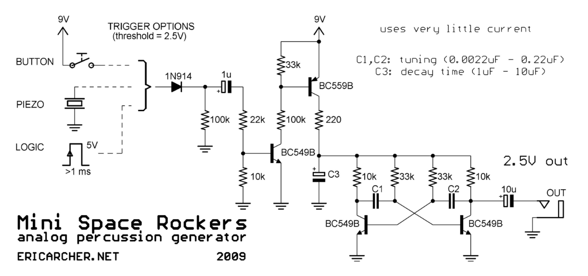

# Lunettas
> Working repo for lunetta synthesizers schematics and ideas

## Table of Contents

## Links
- [DIY Synths Schematics](http://www.sdiy.org/)
- [Birth of a Synth](http://www.birthofasynth.com/)
- [Welcome to Lunetta Thread](https://electro-music.com/forum/viewtopic.php?highlight=lunetta+adsr&t=72084)
- [Intro to Lunetta CMOS Synths](https://docs.google.com/document/d/1V9qerry_PsXTZqt_UDx7C-wcuMe_6_gyy6M_MyAgQoA/edit?usp=sharing)
- [Lunetta Modular by Chris Karcz](https://github.com/ckarcz/Modular-Lunetta)
- [Lunetta Modular by Chris Beckstrom](https://chrisbeckstrom.com/main/the-modular)

## DIY Projects & Schematics

### 40106 FM Drone Synth

- [Description](http://evilturtle.nl/projects/fmdronesynth.html)
- [Audio Example](https://www.youtube.com/watch?v=mjeywq6Ic8Y)

-----

### 40106 RezzoDrone

- [Description](http://evilturtle.nl/projects/rezzodrone.html)
- [Audio Example](https://youtu.be/oY4-PP1GRHY)

-----

### 40106 Synth Drum

- [Audio example](https://electro-music.com/forum/phpbb-files/synth_drum_129.mp3)
- [Forum discussion](https://electro-music.com/forum/topic-63786.html)

-----

### 40106 Voice Modulated Synth

- [Forum discussion](https://electro-music.com/forum/topic-49239.html)

-----

### 555 AD/AR

- [Forum discussion](https://electro-music.com/forum/viewtopic.php?highlight=lunetta+adsr&t=60172)

-----

### Mini Space Rockers
> One-button Percussion Synthesizer

- [PDF Schematics](./mini-space-rockers-instructions.pdf)

-----
